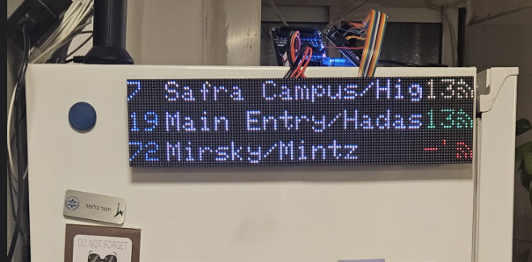
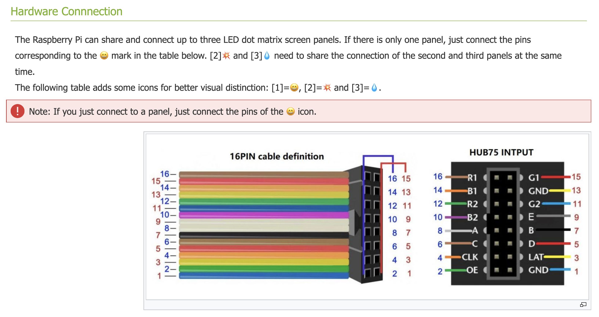

# Bus-404-Found 🚌

> Never miss your bus again! A real-time arrival tracker for your favorite lines and stops, designed to sit on your shelf.

[](LICENSE)
[](https://platformio.org/)
[](https://www.espressif.com/en/products/socs/esp32-s3)



---

## What Is This?

**Bus-404-Found** is a shelf-friendly, real-time bus arrival display built with an **ESP32-S3** and two chained **HUB75 RGB LED matrix panels** (128×32 pixels total). It connects to your Wi-Fi, fetches live arrival data from the [CurlBus](https://curlbus.app/) API, and shows upcoming arrivals with color-coded status at a glance:

| Color | Meaning |
|-------|---------|
| 🟢 Green | Real-time GPS tracking (live) |
| 🟡 Yellow | Scheduled time (no GPS) |
| 🔴 Red | No data |
| ⬜ White | Destination name |
| 🔵 Cyan | bus |

Each row on the display shows: **Line number → Destination → Minutes remaining + bus icon**.

---

## Features

- **Real-time bus arrivals** — fetched every 30 seconds (configurable)
- **Color-coded statuses** — instantly see if data is live GPS or just a schedule
- **Multi-target tracking** — monitor multiple bus lines/stops simultaneously
- **Extensible architecture** — interfaces for display (`IRenderer`) and data source (`IBusFetcher`), ready for OLED/LCD displays or alternative APIs
- **Memory & connection diagnostics** — optional UDP heap reporting for debugging
- **Debug modes** — screen test mode, dummy data mode for development without Wi-Fi

---

## Hardware Requirements
this is very flexable. I tried my best to make the code as flexible as possible.
for example: you may choose yo use different configuration of displays only by
changing single macro, chnage wires configuration the same way, or choose
completly different hardware without changing core code thanks to interface 
"Irenderer" 

| Component | Details | Qty |
|-----------|---------|-----|
| ESP32-S3 DevKitC-1 | Also ESP32 should work | 1 |
| HUB75 LED Matrix Panel | 64×32 pixels, 1/16 scan | 1 or 2 supported |
| 5V Power Supply | ≥4A recommended for two panels | 1 |
| Jumper Wires / Ribbon Cable | For ESP32 ↔ HUB75 wiring | — |
| USB-A Cable | For programming & serial monitor | 1 |

---

## Wiring — ESP32-S3 to HUB75

| Signal | ESP32-S3 GPIO |
|--------|---------------|
| R1 | 4 |
| G1 | 5 |
| B1 | 6 |
| R2 | 7 |
| G2 | 15 |
| B2 | 16 |
| A | 18 |
| B | 8 |
| C | 3 |
| D | 42 |
| E | -1 (unused) |
| LAT | 40 |
| OE | 2 |
| CLK | 41 |

> **Note:** The two panels are daisy-chained via the HUB75 output→input ribbon cable. Only the first panel connects to the ESP32.

use the next picture from https://github.com/CruiseandCoffee that might help 
with wiring:



---

## Software Prerequisites

- [PlatformIO](https://platformio.org/install) (VS Code extension recommended)
- Python 3 (used by the build script `get_ip.py` to inject your PC's LAN IP)

Libraries (automatically installed by PlatformIO):

| Library | Version |
|---------|---------|
| [ArduinoJson](https://github.com/bblanchon/ArduinoJson) | ^6.21.3 |
| [ESP32 HUB75 LED Matrix Panel DMA Display](https://github.com/mrfaptastic/ESP32-HUB75-MatrixPanel-I2S-DMA) | ^3.0.0 |
| [Adafruit GFX Library](https://github.com/adafruit/Adafruit-GFX-Library) | ^1.12.4 |

---

## Getting Started

### 1. Clone the repository

```bash
git clone https://github.com/IdoShalit-design/Bus-404-Found.git
cd Bus-404-Found
```

### 2. Create your secrets file

```bash
cp include/Secrets.h.example include/Secrets.h
```

Edit `include/Secrets.h` and fill in your Wi-Fi credentials:

```cpp
constexpr WifiCredentialsData WIFI_CREDENTIALS = {
    "your_wifi_name",      // SSID
    "your_wifi_password"   // Password
};
```

### 3. Configure your bus targets

Open `include/Config.h` and edit the `MY_TARGETS` array with your station IDs and bus lines:

```cpp
const BusTarget MY_TARGETS[] = {
    {"1570", "7",  "END LINE", false, "", 0},   // Line 7
    {"3541", "19", "END LINE", false, "", 0},   // Line 19
    {"6134", "72", "END LINE", false, "", 0},   // Line 72
};
```

> **Tip:** Find your station ID on [CurlBus](https://curlbus.app/) — it's the number in the URL when you look up a stop.

### 4. Build & upload

```bash
# Build
pio run

# Upload to ESP32
pio run --target upload

# Open serial monitor
pio device monitor
```

Or use the PlatformIO sidebar buttons in VS Code.

---

## Configuration

All configuration lives in `include/Config.h`:

| Option | Default | Description |
|--------|---------|-------------|
| `FETCH_INTERVAL` | `30000` (30s) | How often to fetch new arrivals (ms) |
| `TIME_ZONE` | `"IST-2IDT,M3.4.4/26,M10.5.0"` | POSIX timezone string (default: Israel) |
| `FETCHER_TYPE` | `FETCHER_CURLBUS` | Data source (`FETCHER_CURLBUS`, future: `FETCHER_GOVIL`, `FETCHER_MOCK`) |
| `SCREEN_DEBUG` | `0` | Set to `1` to run infinite display test patterns |
| `DUMMY_BUSES_DEBUG` | `0` | Set to `1` to render dummy data without Wi-Fi |
| `MEMORY_DEBUG` | `1` | Set to `1` to send heap stats via UDP every 60s |

Display settings are in `include/Display/HUB75Display.h`:

| Option | Default | Description |
|--------|---------|-------------|
| `PANEL_CHAIN` | `2` | Number of daisy-chained panels |
| `DISPLAY_BRIGHTNESS` | `32` | LED brightness (0–255) |

---

## Project Structure

```
Bus-404-Found/
├── include/
│   ├── Config.h              # Main configuration (targets, intervals, debug flags)
│   ├── Secrets.h              # Wi-Fi credentials (git-ignored)
│   ├── Secrets.h.example      # Template for Secrets.h
│   ├── Structs.h              # Shared data structures (BusTarget, WifiCredentialsData)
│   ├── TimeManager.h          # NTP time sync utilities
│   ├── Display/
│   │   ├── DisplayConfig.h    # Panel dimensions, pinout, colors
│   │   ├── HUB75Display.h     # HUB75 LED matrix driver
│   │   └── IRenderer.h        # Abstract display interface
│   └── Network/
│       ├── CurlBusFetcher.h   # CurlBus API client
│       ├── IBusFetcher.h      # Abstract data-fetcher interface
│       ├── NetworkManager.h   # Wi-Fi connection manager
│       └── TransitClient.h    # (Planned) Generic transit client
├── src/
│   ├── main.cpp               # Entry point: setup/loop, Wi-Fi, fetch → render
│   ├── TimeManager.cpp        # NTP implementation
│   ├── Display/
│   │   └── HUB75Display.cpp   # HUB75 rendering implementation
│   └── Network/
│       ├── CurlBusFetcher.cpp # CurlBus HTTPS fetch + JSON parsing
│       └── NetworkManager.cpp # Wi-Fi connection implementation
├── get_ip.py                  # Build script: injects PC LAN IP as build flag
├── udp_listener.py            # Helper: listens for heap debug UDP packets
├── platformio.ini             # PlatformIO project config
└── LICENSE                    # MIT License
```

---

## How It Works

```
┌─────────┐    Wi-Fi     ┌────────────────┐    HTTPS     ┌─────────────┐
│  ESP32   │ ──────────► │  curlbus.app   │ ◄──────────  │  Transit    │
│  S3      │             │  (JSON API)    │              │  GTFS Data  │
└────┬─────┘             └────────────────┘              └─────────────┘
     │
     │  DMA
     ▼
┌──────────────────────────────────────┐
│  128×32 HUB75 LED Matrix (2 panels) │
│                                      │
│  7  Givat Ram ·········· 5 min  🚌  │
│  19 Ein Kerem ·········· 7 min  🚌  │
│  72 Romema ············· --     🚌  │
└──────────────────────────────────────┘
```

1. **Boot** → Initialize display, show "Loading..."
2. **Connect** → Join Wi-Fi, sync clock via NTP
3. **Fetch** → For each target, HTTPS GET to `curlbus.app/{stationId}`, parse JSON for matching line
4. **Render** → Color-code each row and paint to the LED matrix via DMA
5. **Repeat** → Every 30 seconds, go to step 3

---

## Debug Modes

### Screen Debug (`SCREEN_DEBUG = 1`)
Runs infinite display test patterns (fill colors, pixel walk, text rendering). Useful to verify your wiring without needing Wi-Fi.

### Dummy Buses (`DUMMY_BUSES_DEBUG = 1`)
Renders hardcoded dummy bus data immediately — no Wi-Fi, no API calls. Great for UI development.

### Memory Debug (`MEMORY_DEBUG = 1`)
Sends heap memory stats (free heap, min free heap, Wi-Fi RSSI) via UDP to your PC every 60 seconds. Use `udp_listener.py` to capture:

```bash
python udp_listener.py
```

---

## Future Plans

- 🔌 Additional data sources (Gov.il GTFS-RT, SIRI API)
- 📡 Wireless connection to choose new bus lines

---

## Contributing

Contributions are welcome! Feel free to:

1. Fork the repo
2. Create a feature branch (`git checkout -b feature/amazing-feature`)
3. Commit your changes (`git commit -m 'Add amazing feature'`)
4. Push to the branch (`git push origin feature/amazing-feature`)
5. Open a Pull Request

---

## License

This project is licensed under the **MIT License** — see the [LICENSE](LICENSE) file for details.

---

<p align="center">
  Made with ❤️ and solder smoke
</p>
